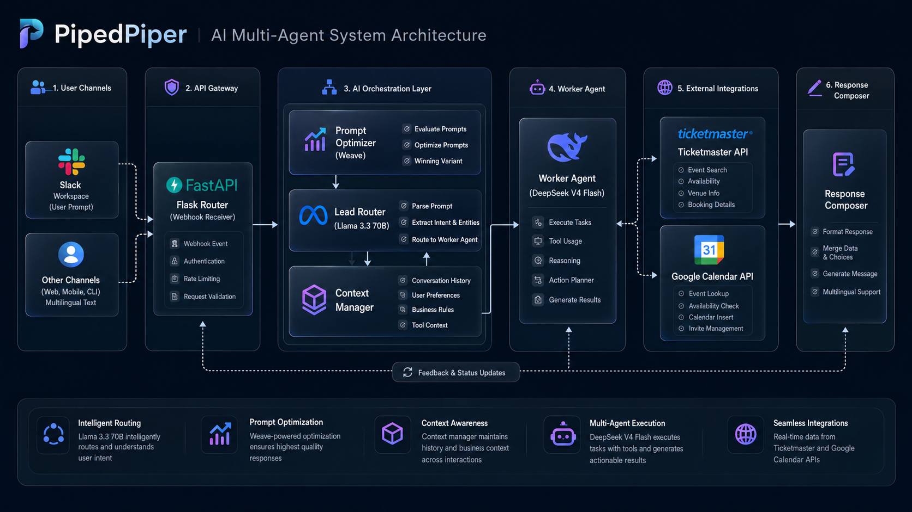
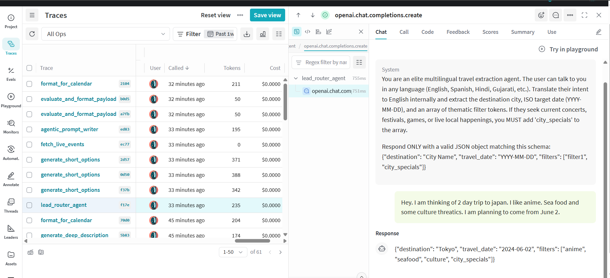
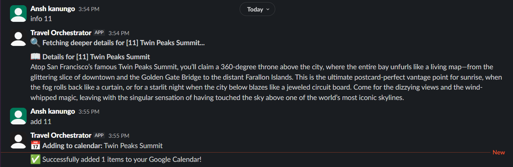
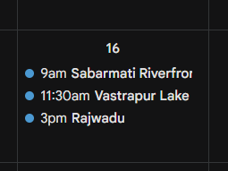

# 🤖 PidePipers: AI Travel Orchestrator

PidePipers is an autonomous, agentic travel planning assistant that lives in your Slack workspace. It goes beyond simple search by utilizing an **Agentic Auto-Optimizer** to bridge the gap between user intent and structured itinerary management.

## 🏗️ System Architecture

The core architecture uses an asynchronous decoupled execution thread pattern to prevent Slack gateway timeouts. It features a dual-model framework where high-level orchestration is handled by Llama-3.3-70B, and high-speed transactional logic is delegated to DeepSeek-V4.



---

## 🚀 Key Features

* **Multilingual Intent Router:** Speak to it in any language. The **Llama-3.3-70B-Instruct** lead agent translates your intent, identifies your destination, and extracts travel dates to orchestrate the backend.
* **Agentic Prompt Optimization:** We leverage **Weights & Biases Weave** to pit multiple prompt strategies against each other in real-time. The system automatically selects and optimizes the prompt that yields the most efficient, human-readable output.
* **Live Event Intelligence:** By integrating the Ticketmaster Discovery API, the system fetches real-world events, ensuring your itinerary isn't just based on static data, but on what is actually happening in the city.
* **Interactive Itinerary Management:**
    * **Concise Summaries:** Receive structured, 5-item, single-line recommendations.
    * **Deep Dives:** Use `info [number]` to trigger an agentic deep-dive into any activity.
    * **Calendar Sync:** Use `add [numbers]` (e.g., `add 1 3`) to automatically schedule your selected activities into your Google Calendar.
* **Dual-Model Architecture:** Uses **Llama-3.3** for high-level reasoning and routing, and **DeepSeek-V4-Flash** for high-speed data parsing and formatting.

---

## 📸 Core Walkthrough & Examples

### 1. Generating Options & Multi-Agent Optimization
When a user inputs a query, the Llama-3.3 Lead Router coordinates with the DeepSeek Worker. Weights & Biases Weave acts as the evaluation harness, tracking real-time prompt generation and mathematical token-efficiency testing.


### 2. Prompt Metrics & Evaluation Pipeline
Through Weights & Biases Weave, competing prompt variants are dynamically benchmarked against formatting strictness and line length constraints before rendering.



### 3. Deep Dive Inspections
Users can inspect specific items via the custom Slack command gateway without re-running the heavy trip generation loops.



### 4. Downstream Synchronization
Selected items are structured into strict timestamped payloads and inserted into the user's primary calendar resource.



---

## 🛠 Tech Stack

* **Backend:** Flask
* **AI Orchestration:** OpenAI SDK / Weights & Biases (Weave)
* **Models:** Llama-3.3-70B (Lead Router), DeepSeek-V4 (Worker)
* **Integrations:** Slack API, Google Calendar API, Ticketmaster Discovery API

---

## ⚙️ Setup & Installation

### Prerequisites
* Python 3.13+
* A Slack App with `chat:write`, `channels:history` permissions.
* A Google Cloud Project with the Calendar API enabled.
* A Weights & Biases account.
* A Ticketmaster Developer API key.

### Configuration
1. Clone the repository.
2. Install dependencies: `pip install -r requirements.txt` (Ensure `slack_sdk`, `weave`, `flask`, and `google-api-python-client` are installed).
3. Create a `.gitignore` file and add `token.json`, `credentials.json`, and `.env` to keep your secrets safe.
4. Update `app.py` with your credentials:
   * `SLACK_BOT_TOKEN`
   * `WANDB_API_KEY`
   * `TICKETMASTER_API_KEY`
5. Place your Google `credentials.json` in the root directory.

### Running the App
```bash
python app.py